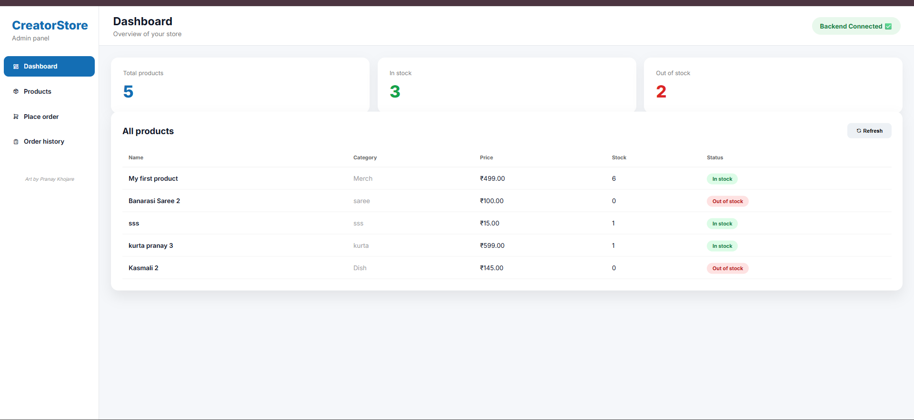
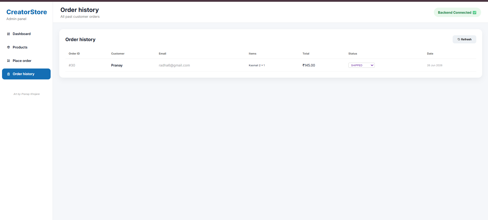

<p align="center">


</p>

# 🛒 CreatorStore

A **Full-Stack E-Commerce Store Management System** built using **Spring Boot, Spring Data JPA, MySQL, and Vanilla JavaScript**.

CreatorStore enables administrators to manage products, maintain inventory, process customer orders, and track delivery status through a clean and responsive admin dashboard.

This project helped me gain practical experience with **REST APIs, JPA, Hibernate, MySQL, deployment, and full-stack development.**

---

# 🚀 Live Demo

### 🌐 Frontend

https://spring-boot-creator-store.vercel.app/

### ⚙️ Backend API

https://springboot-creatorstore-production.up.railway.app/

---

# 📸 Screenshots

## Dashboard



## Order History



---

# ✨ Features

## 📦 Product Management

* Add Products
* Update Products
* Delete Products
* Manage Inventory
* Automatic Stock Updates

---

## 📊 Dashboard

* Total Products
* In-Stock Products
* Out-of-Stock Products
* Inventory Overview

---

## 🛒 Order Management

* Place Customer Orders
* Auto Calculate Total Amount
* Automatic Inventory Deduction
* Prevent Invalid Orders

---

## 🚚 Order History

* View Previous Orders
* Track Order Status
* Update Status

```
Pending
   ↓
Confirmed
   ↓
Delivered
```

---

# 🛠 Tech Stack

## Backend

* Java 21
* Spring Boot
* Spring Web
* Spring Data JPA
* Hibernate
* MySQL
* Maven

## Frontend

* HTML5
* CSS3
* JavaScript (Vanilla)

## Deployment

* Railway
* Vercel
* MySQL

---

# 📂 Project Structure

```text
CreatorStore
│
├── frontend
│   ├── css
│   ├── js
│   └── index.html
│
├── src
│   └── main
│       ├── java
│       │    └── org/pranay/creatorstore
│       │         ├── controller
│       │         ├── service
│       │         ├── repository
│       │         ├── entity
│       │         └── dto
│       │
│       └── resources
│
├── pom.xml
└── README.md
```

---

# 🔌 REST API

## Products

| Method | Endpoint             |
| ------ | -------------------- |
| GET    | `/api/products`      |
| POST   | `/api/products`      |
| PUT    | `/api/products/{id}` |
| DELETE | `/api/products/{id}` |

---

## Orders

| Method | Endpoint                  |
| ------ | ------------------------- |
| GET    | `/api/orders`             |
| POST   | `/api/orders`             |
| PATCH  | `/api/orders/{id}/status` |

---

# ⚙️ Getting Started

## Clone Repository

```bash
git clone https://github.com/PRANAYKHOJARE/SpringBoot-CreatorStore.git
```

## Backend

```bash
cd CreatorStore
mvn spring-boot:run
```

## Configure Database

Update your `application.properties`.

```properties
spring.datasource.url=jdbc:mysql://localhost:3306/creatorstore
spring.datasource.username=root
spring.datasource.password=your_password
```

---

# 💡 Challenges Solved

* Fixed Hibernate Lazy Loading Exception
* Resolved CORS Issues
* Connected Railway with MySQL
* Solved JSON Serialization Problems
* Managed Frontend Deployment on Vercel
* Implemented Automatic Inventory Updates

---

# 📚 What I Learned

* Building REST APIs using Spring Boot
* Spring Data JPA & Hibernate
* Entity Relationships
* MySQL Integration
* Frontend & Backend Communication
* Deployment on Railway & Vercel
* Debugging Production Issues
* Clean Project Architecture

---

# 🚀 Future Improvements

* Spring Security
* JWT Authentication
* Role-Based Access Control
* Customer Login
* Product Search
* Pagination
* Analytics Dashboard
* Payment Gateway
* Docker Support

---

# 👨‍💻 Author

**Pranay Khojare**

Aspiring Java Backend Developer


* 🌐 Portfolio: https://pranaykhojare-portfolio.vercel.app/
* 💼 LinkedIn: https://www.linkedin.com/in/pranay-khojare-a23505211/
* 💻 GitHub: https://github.com/PRANAYKHOJARE

---

# ⭐ Support
